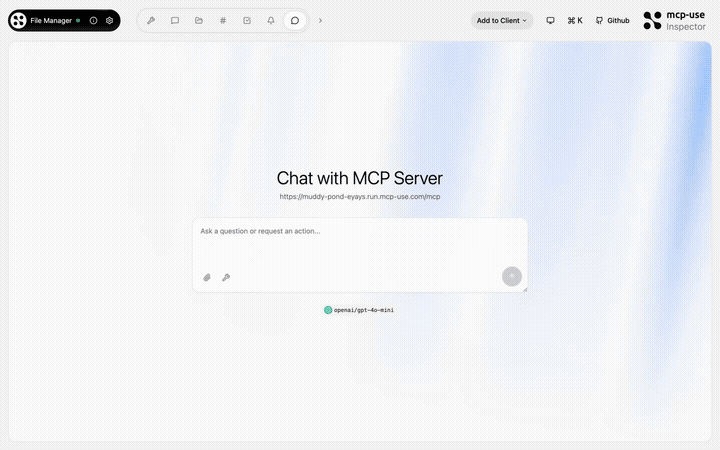
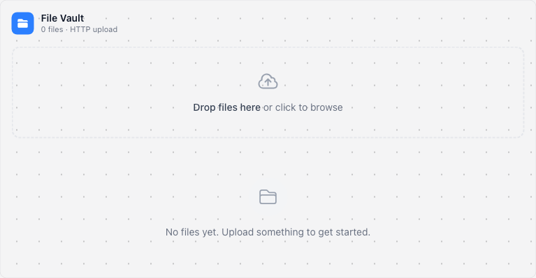

# File Manager — File vault in your chat

<p>
  <a href="https://github.com/mcp-use/mcp-use">Built with <b>mcp-use</b></a>
  &nbsp;
  <a href="https://github.com/mcp-use/mcp-use">
    
  </a>
</p>

File management MCP App showcasing `useFiles`, `Image` components, `ErrorBoundary`, and custom HTTP endpoints. Browse files, view images, and manage a virtual file vault — all inside your chat.



## Try it now

Connect to the hosted instance:

```
https://muddy-pond-eyays.run.mcp-use.com/mcp
```

Or open the [Inspector](https://inspector.manufact.com/inspector?autoConnect=https%3A%2F%2Fmuddy-pond-eyays.run.mcp-use.com%2Fmcp) to test it interactively.

### Setup on ChatGPT

1. Open **Settings** > **Apps and Connectors** > **Advanced Settings** and enable **Developer Mode**
2. Go to **Connectors** > **Create**, name it "File Manager", paste the URL above
3. In a new chat, click **+** > **More** and select the File Manager connector

### Setup on Claude

1. Open **Settings** > **Connectors** > **Add custom connector**
2. Paste the URL above and save

## Features

- **File vault widget** — browse and preview files in a rich UI
- **useFiles hook** — React hook for file access in widgets
- **Image component** — display images with automatic URL resolution
- **ErrorBoundary** — graceful error handling in widgets
- **Custom HTTP endpoints** — serve files via custom routes

## Tools

| Tool | Description |
|------|-------------|
| `open-vault` | Open the file vault browser widget |
| `get-file` | Retrieve a specific file by name |
| `list-files` | List all available files |

## Available Widgets

| Widget | Preview |
|--------|---------|
| `file-vault` |  |

## Local development

```bash
git clone https://github.com/mcp-use/mcp-file-manager.git
cd mcp-file-manager
npm install
npm run dev
```

## Deploy

```bash
npx mcp-use deploy
```

## Built with

- [mcp-use](https://github.com/mcp-use/mcp-use) — MCP server framework

## License

MIT
